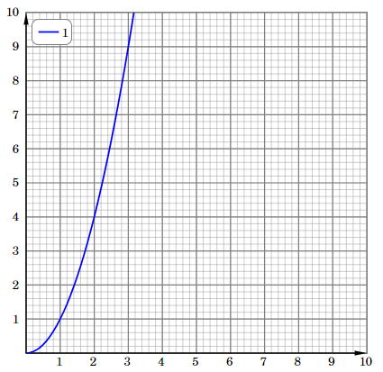
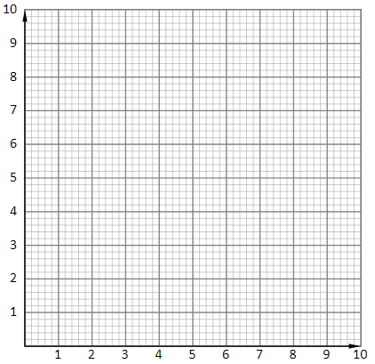
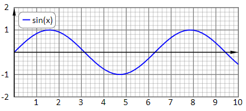
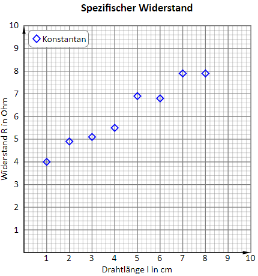
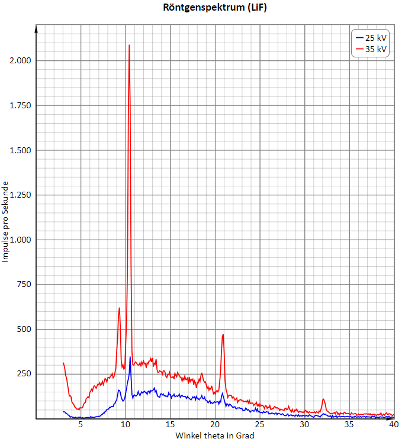
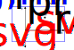

# xy-charts
Ein Custom-HTML-Element zum Darstellen von XY-Daten und Funktionsgraphen. Es wurde besonderes Augenmerk auf das Hauptgitter gelegt: Es soll in
Zentimeter-Einheiten erstellt werden. Achtet man beim Ausdrucken darauf, dass der Druckertreiber keine Skalierungen mehr vornimmt, wird
das Hauptgitter auf dem Blatt in Zentimetereinheiten gedruckt.

## Voraussetzungen
Es ist ein einigermaßen moderner Browser mit Javascript- und SVG-Unterstützung von Nöten. Die Berechnungen, die für die Erstellung
von Funktionsgraphen benötigt werden, werden mit Hilfe der Funktion [evaluate](https://mathjs.org/docs/expressions/parsing.html#evaluate)
von [mathjs](https://mathjs.org/) vorgenommen.

## Installation
Lade die Datei xy-graphs.js in ein geeignetes Verzeichnis und füge im `head` deines HTML-Dokuments folgende Zeilen ein.

```html
<script src="https://cdnjs.cloudflare.com/ajax/libs/mathjs/11.9.0/math.min.js"></script>
<script src="/pfad/zu/xy-graphs.js"></script>
```

Ersetze bitte `/pfad/zu/` mit einer korrekten URL.

## Beschreibung
Diese kleine Bibliothek stellt XY-Daten und Funktionsgraphen nur mit Hilfe von HTML
in einem Diagramm dar. Das Diagramm wird mit SVG erzeugt. Achsenbeschriftung und Skalierungen
werden mit CSS-grid platziert.

```html
<xy-graphs graph-expr-1="x^2"></xy-graphs>
```

erzeugt das folgende Diagramm:



Skalierung, Koordinatengitter und Wertebereiche lassen sich mit HTML-Attributen einstellen. Achsenbeschriftungen und Titel
des Diagramms können mit Hilfe von Slots angegeben werden. Der Standardslot wird direkt auf das Diagramm platziert.

### Attribute
Attribute, die für dieses Template relevant sind, beginnen entweder mit `grid-` oder `graph-`.

#### Attribute für das Gitter
 `grid`-Attribute konfigurieren das Koordinatengitter, die Größe des Diagramms und die Skalierung der Achsen.
 
| Attribut | Funktion | Beispiel | Standard |
| --- | --- | --- | --- |
| `grid‑xmin`<br/>`grid‑ymin` | Untere Intervallgrenze der x- bzw. y-Werte |  -4 | 0 |
| `grid‑xmax`<br/>`grid‑ymax` | Obere Intervallgrenze der x- bzw. y-Werte |  8 | 10 |
| `grid‑xsize`<br/>`grid‑ysize` | Größe des Hauptkästchens in cm |  2 | 1 |
| `grid‑xdelta`<br/>`grid‑ydelta` | Größe des Hauptgitters in x- bzw. y-Werten |  5 | 1 |
| `grid‑xsubdelta`<br/>`grid‑ysubdelta` | Größe des Untergitters in x- bzw. y-Werten |  0.1 | .2 |
| `grid‑xhidegrid`<br/>`grid‑yhidegrid` | Hauptgitter verbergen |  true | false |
| `grid‑xhidesubgrid`<br/>`grid‑yhidesubgrid` | Untergitter verbergen |  true | false |
| `grid‑xhidescale`<br/>`grid‑yhidescale` | Skalierung verbergen |  true | false |
| `grid‑legendposition` | Platzierung der Legende im Diagramm (t, r, b, l, tr, tl, br, bl, none) | tr | tl |
| `grid‑xlegendpadding`<br/>`grid‑ylegendpadding` | Padding in CSS-Koordinaten | 5mm | 2mm |

#### Attribute für Graphen
 Mit Hilfe der `graph`-Attribute können Messwertepaare oder Funktionsgraphen dargestellt werden. Es muss entweder
 das Attribut `graph-values-[id]` oder `graph-expr-[id]` gesetzt werden, damit ein Graph zu sehen ist.

| Attribut | Funktion | Beispiel | Standard |
| --- | --- | --- | --- |
| `graph‑values‑[id]` | Wertepaare in x,y-Koordinaten für Graph der ID `id` als zweidimensionales JSON-Array. | [[0,0],[1,4],[2,6],[3,9]] | null |
| `graph‑expr‑[id]` | Mathematischer Ausdruck, der von math.js evaluiert werden kann. Muss x als Variable enthalten. | 2*sin(x) | null |
| `graph‑start‑[id]` | x-Startwert des Graphen mit der ID `id`. | -4 | grid-xmin |
| `graph‑end‑[id]` | x-Endwert des Graphen mit der ID `id`. | 20 | grid-xmax |
| `graph‑step‑[id]` | Schrittweite der x-Werte zum Graphen mit der ID `id`. | 0.02 | grid-xsubdelta |
| `graph‑name‑[id]` | Der Name, der in der Legende für den Graphen mit der ID `id` angezeigt wird. Fehlt diese Angabe wird der Wert von `id` in der Legende angezeigt. | Sinus | null |
| `graph‑nolegend‑[id]` | Graph wird nicht in die Legende eingetragen. | true | false |
| `graph‑symbol‑[id]` | Gibt an, wie der Graph zur ID `id` dargestellt werden soll (line, circle, cross, square, diamond, triangle).  | diamond | line |
| `graph‑linewidth‑[id]` | Die Liniendicke des Graphen zur ID `id` in CSS-Einheiten.  | 2pt | 1.3pt |
| `graph‑symbolsize‑[id]` | Die Größe der Symbole des Graphen zur ID `id` in cm.  | 0.1 | 0.15 |
| `graph‑strokecolor‑[id]` | Die Linienfarbe des Graphen zur ID `id`.  | magenta | blue |
| `graph‑fillcolor‑[id]` | Die Füllfarbe des Graphen zur ID `id`.  | cyan | null |

### Slots
xy-graphs stellt sieben Slots zur Verfügung, die in der folgenden Tabelle erklärt sind.
| Slot | Funktion | Beispiel |
| --- | --- | --- |
| standardslot | Wird direkt auf dem Diagramm dargestellt | |
| `title` | Die Überschrift des Diagramms. | `<div slot="title">Röntgenspektrum</div>` |
| `xlabel` | Die Beschriftung der x-Achse. | `<div slot="xlabel">Spannung U in V</div>` |
| `ylabel` | Die Beschriftung der y-Achse. | `<div slot="ylabel">Stromstärke I in A</div>` |
| `legend‑before` | Text vor der Legende | `<div slot="legend-before">Legende:</div>` |
| `legend‑after` | Text nach der Legende | `<div slot="legend-after">gemessen mit Spezialgerät</div>` |
| `error` | Formatiert die Fehlermeldung. Nur zum internen Gebrauch gedacht. | |

### Parts
Um die internen HTML-Elemente mit CSS zu gestalten, sind folgende Parts definiert:
| Part | Bedeutung |
| --- | --- |
| `xscale` | Die Skalierung bzw. Nummern der x-Achse |
| `yscale` | Die Skalierung bzw. Nummern der y-Achse |
| `grid` | Das Hauptgitter |
| `subgrid` | Das Untergitter |
| `xaxis` | Die Linie für die x-Achse |
| `yaxis` | Die Linie für die y-Achse |
| `legend` | Die Legende insgesamt |
| `legenditem[id]` | Der Legendeneintrag zum Graphen mit der id [id] |
| `legendgraph[id]` | Der Graph mit der id [id] |


## Beispiele
### Gitter ohne Graph
```html
<xy-graphs grid-legendposition="none"></xy-graphs>
```


### Einfache Funktion
```html
<xy-graphs grid-ymax="2" grid-ymin="-2" graph-expr-1="sin(x)"></xy-graphs>
```


### Messung mit Beschriftung
```html
<xy-graphs graph-values-1="[[1,4],[2,4.9],[3,5.1],[4,5.5],[5,6.9],[6,6.8],[7,7.9],[8,7.9]]"
           graph-symbol-1="diamond" graph-name-1="Konstantan">
    <h3 slot="title">Spezifischer Widerstand</h3>
    <div slot="xlabel">Drahtlänge l in cm</div>
    <div slot="ylabel">Widerstand R in Ohm</div>
</xy-graphs>
```



## Zwei Messungen mit verschiedenen Parameter
```html
<xy-graphs 
        graph-values-1='[[3.0,39.0],[3.1,40.0],[3.2,39.0],[3.3,33.0],[3.4,29.0],[3.5,27.0],[3.6,21.0],[3.7,19.0],[3.8,10.0],[3.9,13.0],[4.0,11.0],[4.1,8.0],[4.2,9.0],[4.3,6.0],[4.4,10.0],[4.5,6.0],[4.6,5.0],[4.7,9.0],[4.8,8.0],[4.9,10.0],[5.0,7.0],[5.1,4.0],[5.2,8.0],[5.3,4.0],[5.4,5.0],[5.5,6.0],[5.6,8.0],[5.7,8.0],[5.8,8.0],[5.9,7.0],[6.0,6.0],[6.1,13.0],[6.2,9.0],[6.3,10.0],[6.4,9.0],[6.5,8.0],[6.6,11.0],[6.7,12.0],[6.8,13.0],[6.9,12.0],[7.0,15.0],[7.1,14.0],[7.2,18.0],[7.3,24.0],[7.4,26.0],[7.5,33.0],[7.6,32.0],[7.7,41.0],[7.8,44.0],[7.9,53.0],[8.0,54.0],[8.1,55.0],[8.2,65.0],[8.3,63.0],[8.4,70.0],[8.5,70.0],[8.6,69.0],[8.7,83.0],[8.8,86.0],[8.9,99.0],[9.0,106.0],[9.1,134.0],[9.2,161.0],[9.3,159.0],[9.4,148.0],[9.5,122.0],[9.6,108.0],[9.7,100.0],[9.8,105.0],[9.9,116.0],[10.0,144.0],[10.1,169.0],[10.2,202.0],[10.3,222.0],[10.4,254.0],[10.5,348.0],[10.6,236.0],[10.7,138.0],[10.8,116.0],[10.9,130.0],[11.0,134.0],[11.1,128.0],[11.2,129.0],[11.3,136.0],[11.4,153.0],[11.5,139.0],[11.6,130.0],[11.7,143.0],[11.8,151.0],[11.9,145.0],[12.0,150.0],[12.1,155.0],[12.2,148.0],[12.3,146.0],[12.4,137.0],[12.5,154.0],[12.6,156.0],[12.7,144.0],[12.8,159.0],[12.9,155.0],[13.0,158.0],[13.1,163.0],[13.2,172.0],[13.3,151.0],[13.4,159.0],[13.5,137.0],[13.6,125.0],[13.7,123.0],[13.8,120.0],[13.9,139.0],[14.0,141.0],[14.1,134.0],[14.2,139.0],[14.3,129.0],[14.4,130.0],[14.5,125.0],[14.6,128.0],[14.7,124.0],[14.8,146.0],[14.9,135.0],[15.0,136.0],[15.1,117.0],[15.2,128.0],[15.3,129.0],[15.4,138.0],[15.5,124.0],[15.6,127.0],[15.7,129.0],[15.8,125.0],[15.9,132.0],[16.0,138.0],[16.1,120.0],[16.2,128.0],[16.3,132.0],[16.4,126.0],[16.5,125.0],[16.6,126.0],[16.7,123.0],[16.8,114.0],[16.9,125.0],[17.0,119.0],[17.1,115.0],[17.2,110.0],[17.3,107.0],[17.4,114.0],[17.5,123.0],[17.6,118.0],[17.7,123.0],[17.8,107.0],[17.9,125.0],[18.0,114.0],[18.1,113.0],[18.2,107.0],[18.3,115.0],[18.4,118.0],[18.5,130.0],[18.6,114.0],[18.7,112.0],[18.8,122.0],[18.9,107.0],[19.0,103.0],[19.1,101.0],[19.2,90.0],[19.3,95.0],[19.4,102.0],[19.5,87.0],[19.6,91.0],[19.7,86.0],[19.8,90.0],[19.9,96.0],[20.0,92.0],[20.1,94.0],[20.2,96.0],[20.3,96.0],[20.4,83.0],[20.5,98.0],[20.6,94.0],[20.7,126.0],[20.8,142.0],[20.9,125.0],[21.0,107.0],[21.1,89.0],[21.2,71.0],[21.3,85.0],[21.4,82.0],[21.5,72.0],[21.6,82.0],[21.7,79.0],[21.8,74.0],[21.9,68.0],[22.0,63.0],[22.1,67.0],[22.2,68.0],[22.3,58.0],[22.4,57.0],[22.5,62.0],[22.6,61.0],[22.7,62.0],[22.8,58.0],[22.9,60.0],[23.0,57.0],[23.1,46.0],[23.2,48.0],[23.3,47.0],[23.4,60.0],[23.5,55.0],[23.6,49.0],[23.7,52.0],[23.8,46.0],[23.9,38.0],[24.0,44.0],[24.1,44.0],[24.2,48.0],[24.3,43.0],[24.4,44.0],[24.5,60.0],[24.6,44.0],[24.7,55.0],[24.8,39.0],[24.9,42.0],[25.0,36.0],[25.1,35.0],[25.2,38.0],[25.3,33.0],[25.4,42.0],[25.5,36.0],[25.6,36.0],[25.7,40.0],[25.8,39.0],[25.9,39.0],[26.0,28.0],[26.1,30.0],[26.2,28.0],[26.3,33.0],[26.4,32.0],[26.5,30.0],[26.6,27.0],[26.7,32.0],[26.8,33.0],[26.9,24.0],[27.0,31.0],[27.1,31.0],[27.2,29.0],[27.3,26.0],[27.4,25.0],[27.5,29.0],[27.6,26.0],[27.7,20.0],[27.8,18.0],[27.9,18.0],[28.0,24.0],[28.1,28.0],[28.2,17.0],[28.3,20.0],[28.4,22.0],[28.5,22.0],[28.6,17.0],[28.7,21.0],[28.8,18.0],[28.9,15.0],[29.0,22.0],[29.1,21.0],[29.2,15.0],[29.3,23.0],[29.4,15.0],[29.5,17.0],[29.6,18.0],[29.7,15.0],[29.8,21.0],[29.9,18.0],[30.0,16.0],[30.1,17.0],[30.2,19.0],[30.3,16.0],[30.4,15.0],[30.5,23.0],[30.6,20.0],[30.7,16.0],[30.8,14.0],[30.9,11.0],[31.0,9.0],[31.1,16.0],[31.2,19.0],[31.3,20.0],[31.4,17.0],[31.5,16.0],[31.6,15.0],[31.7,10.0],[31.8,17.0],[31.9,21.0],[32.0,26.0],[32.1,29.0],[32.2,25.0],[32.3,26.0],[32.4,21.0],[32.5,21.0],[32.6,15.0],[32.7,16.0],[32.8,14.0],[32.9,17.0],[33.0,6.0],[33.1,19.0],[33.2,10.0],[33.3,13.0],[33.4,13.0],[33.5,18.0],[33.6,8.0],[33.7,13.0],[33.8,12.0],[33.9,15.0],[34.0,12.0],[34.1,13.0],[34.2,13.0],[34.3,15.0],[34.4,11.0],[34.5,13.0],[34.6,12.0],[34.7,13.0],[34.8,15.0],[34.9,13.0],[35.0,11.0],[35.1,14.0],[35.2,11.0],[35.3,8.0],[35.4,12.0],[35.5,10.0],[35.6,16.0],[35.7,13.0],[35.8,9.0],[35.9,12.0],[36.0,12.0],[36.1,10.0],[36.2,13.0],[36.3,10.0],[36.4,12.0],[36.5,12.0],[36.6,12.0],[36.7,15.0],[36.8,8.0],[36.9,14.0],[37.0,11.0],[37.1,11.0],[37.2,11.0],[37.3,11.0],[37.4,7.0],[37.5,14.0],[37.6,15.0],[37.7,11.0],[37.8,16.0],[37.9,4.0],[38.0,11.0],[38.1,9.0],[38.2,10.0],[38.3,6.0],[38.4,12.0],[38.5,11.0],[38.6,10.0],[38.7,11.0],[38.8,9.0],[38.9,8.0],[39.0,10.0],[39.1,13.0],[39.2,13.0],[39.3,10.0],[39.4,15.0],[39.5,9.0],[39.6,8.0],[39.7,11.0],[39.8,10.0],[39.9,8.0],[40.0,10.0]]'
        graph-values-2='[[3.0,315.0],[3.1,304.0],[3.2,281.0],[3.3,242.0],[3.4,229.0],[3.5,195.0],[3.6,164.0],[3.7,128.0],[3.8,131.0],[3.9,123.0],[4.0,94.0],[4.1,87.0],[4.2,81.0],[4.3,68.0],[4.4,64.0],[4.5,56.0],[4.6,54.0],[4.7,56.0],[4.8,51.0],[4.9,62.0],[5.0,62.0],[5.1,61.0],[5.2,65.0],[5.3,81.0],[5.4,89.0],[5.5,92.0],[5.6,116.0],[5.7,117.0],[5.8,124.0],[5.9,118.0],[6.0,148.0],[6.1,156.0],[6.2,166.0],[6.3,156.0],[6.4,178.0],[6.5,185.0],[6.6,180.0],[6.7,171.0],[6.8,183.0],[6.9,194.0],[7.0,191.0],[7.1,202.0],[7.2,188.0],[7.3,194.0],[7.4,209.0],[7.5,191.0],[7.6,208.0],[7.7,226.0],[7.8,220.0],[7.9,206.0],[8.0,230.0],[8.1,232.0],[8.2,227.0],[8.3,239.0],[8.4,243.0],[8.5,253.0],[8.6,229.0],[8.7,237.0],[8.8,258.0],[8.9,281.0],[9.0,377.0],[9.1,452.0],[9.2,579.0],[9.3,622.0],[9.4,519.0],[9.5,331.0],[9.6,290.0],[9.7,301.0],[9.8,278.0],[9.9,284.0],[10.0,414.0],[10.1,541.0],[10.2,835.0],[10.3,1700.0],[10.4,2089.0],[10.5,1746.0],[10.6,855.0],[10.7,377.0],[10.8,302.0],[10.9,300.0],[11.0,311.0],[11.1,318.0],[11.2,313.0],[11.3,305.0],[11.4,300.0],[11.5,302.0],[11.6,314.0],[11.7,293.0],[11.8,318.0],[11.9,305.0],[12.0,322.0],[12.1,307.0],[12.2,310.0],[12.3,285.0],[12.4,313.0],[12.5,307.0],[12.6,323.0],[12.7,322.0],[12.8,337.0],[12.9,318.0],[13.0,341.0],[13.1,292.0],[13.2,311.0],[13.3,306.0],[13.4,334.0],[13.5,276.0],[13.6,259.0],[13.7,262.0],[13.8,269.0],[13.9,265.0],[14.0,264.0],[14.1,249.0],[14.2,268.0],[14.3,268.0],[14.4,260.0],[14.5,237.0],[14.6,231.0],[14.7,249.0],[14.8,247.0],[14.9,261.0],[15.0,235.0],[15.1,232.0],[15.2,231.0],[15.3,237.0],[15.4,222.0],[15.5,254.0],[15.6,243.0],[15.7,235.0],[15.8,259.0],[15.9,248.0],[16.0,241.0],[16.1,232.0],[16.2,230.0],[16.3,211.0],[16.4,228.0],[16.5,217.0],[16.6,238.0],[16.7,221.0],[16.8,219.0],[16.9,232.0],[17.0,196.0],[17.1,235.0],[17.2,204.0],[17.3,222.0],[17.4,215.0],[17.5,222.0],[17.6,190.0],[17.7,212.0],[17.8,200.0],[17.9,172.0],[18.0,204.0],[18.1,201.0],[18.2,222.0],[18.3,210.0],[18.4,241.0],[18.5,258.0],[18.6,235.0],[18.7,214.0],[18.8,205.0],[18.9,208.0],[19.0,190.0],[19.1,170.0],[19.2,180.0],[19.3,161.0],[19.4,173.0],[19.5,166.0],[19.6,185.0],[19.7,164.0],[19.8,141.0],[19.9,148.0],[20.0,138.0],[20.1,154.0],[20.2,159.0],[20.3,151.0],[20.4,160.0],[20.5,208.0],[20.6,267.0],[20.7,380.0],[20.8,460.0],[20.9,474.0],[21.0,369.0],[21.1,212.0],[21.2,166.0],[21.3,148.0],[21.4,120.0],[21.5,131.0],[21.6,133.0],[21.7,131.0],[21.8,131.0],[21.9,117.0],[22.0,124.0],[22.1,117.0],[22.2,106.0],[22.3,111.0],[22.4,117.0],[22.5,92.0],[22.6,103.0],[22.7,105.0],[22.8,107.0],[22.9,107.0],[23.0,100.0],[23.1,102.0],[23.2,96.0],[23.3,97.0],[23.4,99.0],[23.5,95.0],[23.6,103.0],[23.7,89.0],[23.8,104.0],[23.9,85.0],[24.0,88.0],[24.1,89.0],[24.2,88.0],[24.3,75.0],[24.4,81.0],[24.5,85.0],[24.6,93.0],[24.7,73.0],[24.8,80.0],[24.9,70.0],[25.0,85.0],[25.1,72.0],[25.2,77.0],[25.3,75.0],[25.4,70.0],[25.5,58.0],[25.6,75.0],[25.7,72.0],[25.8,59.0],[25.9,67.0],[26.0,62.0],[26.1,74.0],[26.2,53.0],[26.3,55.0],[26.4,58.0],[26.5,59.0],[26.6,69.0],[26.7,67.0],[26.8,60.0],[26.9,64.0],[27.0,59.0],[27.1,59.0],[27.2,47.0],[27.3,54.0],[27.4,52.0],[27.5,51.0],[27.6,49.0],[27.7,48.0],[27.8,60.0],[27.9,59.0],[28.0,52.0],[28.1,55.0],[28.2,70.0],[28.3,55.0],[28.4,47.0],[28.5,39.0],[28.6,53.0],[28.7,39.0],[28.8,38.0],[28.9,51.0],[29.0,46.0],[29.1,55.0],[29.2,44.0],[29.3,37.0],[29.4,42.0],[29.5,40.0],[29.6,40.0],[29.7,36.0],[29.8,40.0],[29.9,35.0],[30.0,46.0],[30.1,48.0],[30.2,38.0],[30.3,40.0],[30.4,33.0],[30.5,40.0],[30.6,37.0],[30.7,36.0],[30.8,35.0],[30.9,37.0],[31.0,36.0],[31.1,40.0],[31.2,33.0],[31.3,40.0],[31.4,38.0],[31.5,33.0],[31.6,44.0],[31.7,38.0],[31.8,53.0],[31.9,70.0],[32.0,106.0],[32.1,110.0],[32.2,98.0],[32.3,79.0],[32.4,53.0],[32.5,44.0],[32.6,41.0],[32.7,36.0],[32.8,32.0],[32.9,29.0],[33.0,31.0],[33.1,31.0],[33.2,32.0],[33.3,36.0],[33.4,28.0],[33.5,40.0],[33.6,39.0],[33.7,25.0],[33.8,32.0],[33.9,24.0],[34.0,34.0],[34.1,29.0],[34.2,29.0],[34.3,27.0],[34.4,38.0],[34.5,36.0],[34.6,29.0],[34.7,31.0],[34.8,31.0],[34.9,30.0],[35.0,27.0],[35.1,23.0],[35.2,34.0],[35.3,29.0],[35.4,27.0],[35.5,28.0],[35.6,29.0],[35.7,30.0],[35.8,20.0],[35.9,22.0],[36.0,27.0],[36.1,22.0],[36.2,26.0],[36.3,24.0],[36.4,26.0],[36.5,23.0],[36.6,28.0],[36.7,28.0],[36.8,28.0],[36.9,29.0],[37.0,26.0],[37.1,28.0],[37.2,24.0],[37.3,29.0],[37.4,22.0],[37.5,24.0],[37.6,23.0],[37.7,26.0],[37.8,26.0],[37.9,22.0],[38.0,19.0],[38.1,25.0],[38.2,21.0],[38.3,26.0],[38.4,25.0],[38.5,33.0],[38.6,21.0],[38.7,20.0],[38.8,27.0],[38.9,21.0],[39.0,27.0],[39.1,34.0],[39.2,28.0],[39.3,24.0],[39.4,29.0],[39.5,28.0],[39.6,26.0],[39.7,22.0],[39.8,18.0],[39.9,24.0],[40.0,21.0]]'
        graph-name-1="25 kV"
        graph-name-2="35 kV"
        grid-legendposition="tr"
        grid-xmax="40" grid-xdelta="5" grid-xsubdelta="1" grid-xsize="2"
        grid-ymax="2200" grid-ydelta="250" grid-ysubdelta="50" grid-ysize="2">
    <h3 slot="title">Röntgenspektrum (LiF)</h3>
    <div slot="xlabel">Winkel theta in Grad</div>
    <div slot="ylabel">Impulse pro Sekunde</div>
</xy-graphs>
```



## SVG-Koordinaten und reale Werte
Für die Abbildung der Wertekoordinaten auf SVG-Koordinaten ist folgende Abbildung hilfreich:



Die schwarzen Achsen stellen das Koordinatensystem der realen Werte dar, so wie es normalerweise gezeichnet wird (Y-Achse nach oben).
Die roten Achsen stellen das SVG-Koordinatensystem dar. Die Ursprünge und X-Achsen der beiden Koordinatensysteme liegen übereinander.
Die jeweiligen Achsen der realen Werte und der SVG-Koordinaten haben verschiedene Skalierungen `xscale` und `yscale`. Hat ein Punkt im realen
Koordinatensystem die Koordinaten `xr` und `yr` haben, dann hat er im SVG-Koordinatensystem die Koordinaten
`xr*xscale` und `‑yr*yscale`. Man beachte das Minuszeichen bei der Y-Koordinate.

Mit Hilfe der SVG-Attribute `width`, `height` und `viewBox` lässt sich der sichtbare Ausschnitt und die Größe der SVG-Abbildung
einstellen. Die Breite wird auf `(xrmax‑xrmin)cm` und die Höhe auf `(yrmax‑yrmin)cm` gesetzt. Das Attribut `viewBox` muss in
SVG-Koordinaten angegeben werden. Anhand der Abbildung erkennt man die Parameter
`xmin*xscale ‑ymax*yscale (xrmax‑xrmin)*xscale (yrmax‑yrmin)*yscale`.
